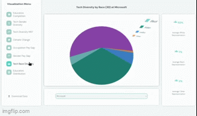

# Data Visualization Dashboard

## Overview

The Data Visualization Dashboard is a case study which extends the functionality of an existing p5.js visualization platform. This implementation adds two additional p5.js visuals and also several 3D visualizations built with Three.js. The project blends creative coding with modern web technologies to offer an interactive user experience.

Live Demo: https://data-visualizer-p5.vercel.app/

## Features

Diverse Visual Modules:

- Eight distinct visualization modules. Some are powered by p5.js and others use Three.js for 3D interactivity

Interactive Experience:

- The dashboard features a left-side navigation menu for easy switching between visuals, a central gallery that dynamically displays your selected visual, and a control panel with sliders and dropdowns to adjust visualizations. The stats panel updates live to reflect key data points as you interact with the visuals.

Seamless Data Integration:

- Cloud Firestore is used for dynamic data fetching.

Downloadable Insights:

- Using the download button you can export the current dataset as a JSON file.

Responsive and Future-Ready:

- Built with modern web standards—HTML5, CSS3, and Material Icons—the dashboard is designed to perform across all devices.

## Technologies

JavaScript: For dynamic content and logic.
p5.js: Creative coding and 2D visualisations to life.
Three.js: For immersive 3D visualisation experiences.
Firebase: Handling backend data seamlessly.
HTML5 & CSS3: Modern, responsive design.
Material Icons: Adding intuitive UI elements.

# Installation

Since this project is designed to run directly on a live server with no build process, you simply need to host the files on your preferred server.

1. Download or Clone the Repository:
2. Run the Project:
   - Open the index.html file in your browser, or use your live server of choice (such as the Live Server extension in VSCode) to view the project.

# Usage

Select a Visual: - Use the left-side navigation menu to choose from eight available visuals.

View and Interact: - The selected visual is displayed in the central gallery. - Use the control panel below the visual to adjust settings via sliders and dropdown menus. - Monitor real-time stats on the right panel.

Download Data: - Click the download button to export the current visual's dataset in JSON format.

# License

This project is licensed under the MIT License. You are free to use, modify, and distribute the project as per the license terms.

# Contact

For any inquiries or feedback, feel free to contact me at: butlerem01@gmail.com
